# Releases on the Mac mini

`develop` is for local development and testing. `master` is the release branch. Only a
push to `master` (or a manual Release run targeting `master`) can publish and deploy.
Pull requests run checks without deployment access.

```mermaid
flowchart LR
    D[develop: local Docker and testing] -->|merge approved changes| M[master]
    M --> T[GitHub: lint and PostgreSQL tests]
    T --> B[ARM64 build and container smoke test]
    B --> R[GHCR: image tagged with commit SHA]
    R -->|immutable digest| J[Deployment job]
    J -->|Tailscale + verified SSH| S[Mac mini]
    S --> P[Pull image]
    P --> K[Database backup]
    K --> A[Alembic migration]
    A --> W[Replace web container]
    W --> H[Readiness and catalog checks]
```



The GitHub runner connects to the mini to run Docker Compose. It does not copy the source
repository or build on the server. Application images come from GHCR. PostgreSQL data stays
in the `athena-release_postgres_data` volume between releases. Server imports populate that
database separately from your laptop's development catalog.

## 1. Prepare the Mac mini

Perform these steps **on the server**, using the macOS account that will run Athena:

1. Install and start Docker Desktop for Apple Silicon and Tailscale. Join the mini to your
   tailnet. Ensure `docker info` and `docker compose version` work in Terminal.
2. Enable macOS **System Settings → General → Sharing → Remote Login**, allowing only the
   deployment account. Use ordinary OpenSSH over Tailscale; this guide does not require
   the Tailscale SSH server feature or router port forwarding.
3. Prevent system sleep while serving. Configure Docker Desktop to start at login and
   test recovery after a reboot. A FileVault unlock or user login may still be required;
   container restart policies cannot start Docker Desktop itself.
4. Create the server directory:

   ```sh
   mkdir -p ~/athena
   chmod 700 ~/athena
   openssl rand -hex 32
   ```

5. Create `~/athena/.env` using [deploy/.env.example](../deploy/.env.example). Paste the
   generated value after `POSTGRES_PASSWORD=`. Keep it exactly 64 hex characters. Set your
   contact email and optional OpenAlex API key, then run `chmod 600 ~/athena/.env`.
   Never commit this file. Do not change the password after database initialization without
   also changing the database role password.

The release app binds to `127.0.0.1:8001` on the mini. PostgreSQL has no published port.
The default local stack remains on ports 8000 and 5433.

## 2. Configure SSH and Tailscale

On your development machine, create a dedicated automation key:

```sh
ssh-keygen -t ed25519 -f ~/.ssh/athena_deploy -C athena-deploy
```

Leave its passphrase empty so this dedicated key can run unattended. Add the **public**
key (`athena_deploy.pub`) to the deployment account's `~/.ssh/authorized_keys` on the mini;
use mode 700 for `~/.ssh` and 600 for `authorized_keys`. Restrict that account's Remote Login
access and keep its credentials separate from your personal SSH keys.

In Tailscale, define `tag:athena-ci` and `tag:athena-server`, tag the mini as
`tag:athena-server`, and permit the CI tag to reach the server tag on TCP port 22. Create
an OAuth client authorized to create tagged devices with `tag:athena-ci`. Merge the needed
rule into your existing tailnet policy; broader existing rules may already grant more access.
Follow the [official GitHub Action setup](https://tailscale.com/docs/integrations/github/github-action)
for OAuth scopes and tag ownership. CI nodes are ephemeral.

Verify an SSH connection from your own Tailscale-connected computer (replace `ACCOUNT`
and `MINI_HOST` with the mini's account and Tailscale IPv4 or full MagicDNS hostname):

```sh
ssh -i ~/.ssh/athena_deploy ACCOUNT@MINI_HOST
```

Verify the host key fingerprint against the mini's local Terminal output:

```sh
ssh-keygen -lf /etc/ssh/ssh_host_ed25519_key.pub
```

For GitHub's known-hosts secret, use a line containing the **exact** `MINI_HOST`, followed
by the mini's public host key, for example `MINI_HOST ssh-ed25519 AAAA...`. Get that public
key from `/etc/ssh/ssh_host_ed25519_key.pub` on the mini. Do not use a private host key.
The pipeline requires the pinned key; it never blindly trusts `ssh-keyscan` output.

## 3. Allow the mini to pull images

The workflow publishes `ghcr.io/isaiahmcnealy/athena:<commit-sha>`. It records and deploys
the image's immutable SHA-256 digest. GitHub Actions uses its built-in token to publish.

For a **private** GHCR package, log Docker in on the mini as the deployment account with a
GitHub personal access token (classic) that has `read:packages` and access to the package:

```sh
docker login ghcr.io --username YOUR_GITHUB_USERNAME
```

Paste the token at the password prompt. A public package can be pulled without login.
After the first publish, verify a pull from a **noninteractive SSH session**; macOS
credential helpers may need an unlocked login keychain. Resolve that before enabling
deployment. See [GitHub's GHCR authentication documentation](https://docs.github.com/en/packages/working-with-a-github-packages-registry/working-with-the-container-registry).

## 4. Configure GitHub

In the repository's **Settings → Environments**, create `mac-mini` and, where your GitHub
plan supports it, limit deployment branches to `master`.

Add these **environment secrets**:

| Secret | Value |
| --- | --- |
| `TS_OAUTH_CLIENT_ID` | Tailscale OAuth client ID |
| `TS_OAUTH_SECRET` | Tailscale OAuth client secret |
| `MAC_MINI_SSH_KEY` | Complete contents of the dedicated `athena_deploy` private key |
| `MAC_MINI_KNOWN_HOSTS` | Verified host-key line matching `MAC_MINI_HOST` exactly |

Add these **environment variables**:

| Variable | Value |
| --- | --- |
| `MAC_MINI_HOST` | Tailscale IPv4 or full MagicDNS hostname; no URL scheme or port |
| `MAC_MINI_USER` | macOS deployment account's short username |

Under **Settings → Secrets and variables → Actions → Variables**, add the **repository
variable** `MAC_MINI_DEPLOY_ENABLED` with value `false` initially. This must be a repository
variable, because the job's condition is evaluated before its environment is loaded.
When the mini is ready, change it to `true`.

Allow Actions to publish packages. If a package already exists, grant this repository
Actions access to it. Protect `master` with pull requests and required checks when available.
GitHub settings and secrets are configured separately; committing these files does not
change your repository's default branch or protections.

## 5. First release and subsequent releases

Commit the pipeline changes on `develop`, test them, then create the first remote release branch:

```sh
git switch develop
git add .github/workflows/ci.yml .github/workflows/release.yml deploy docs README.md CHANGELOG.md tests/test_deployment.py
git commit -m "Add master release pipeline for Mac mini deployment"
git push origin develop
git switch master
git merge --ff-only develop
git push -u origin master
git switch develop
```

`master` was created locally from the initial working commit. These commands bring the
pipeline into it and publish it. No deployment occurs while the setup variable is false;
tests and image publishing still run. Once setup is complete, set the variable to true
and rerun **Actions → Release** on `master` (or push the next release). If the Run workflow
button is unavailable, ensure the workflow also exists on the repository's default branch.

For later releases, push tested changes to `develop`, open a pull request from `develop`
to `master`, and merge it. Use a regular merge so shared history stays connected. Continue
local development on `develop`. Never place development databases or `.env` files in Git.

## 6. Populate and inspect the server

After the first successful deployment, on the mini:

```sh
bash ~/athena/current/manage.sh ps
bash ~/athena/current/manage.sh logs --tail=100 web
bash ~/athena/current/manage.sh run --rm --no-deps ingest ingest arxiv --limit 50
bash ~/athena/current/manage.sh run --rm --no-deps ingest ingest openalex --query 'machine learning healthcare' --limit 50
curl --fail http://127.0.0.1:8001/health/ready
```

Imports are explicit, not a side effect of every deployment. From another computer on your
tailnet, use an SSH tunnel and open `http://localhost:8001`:

```sh
ssh -L 8001:127.0.0.1:8001 ACCOUNT@MINI_HOST
```

Keep the SSH session open while browsing. Public HTTPS ingress and scheduled ingestion are
separate future changes; this initial server deployment is private.

## Failure and recovery

Each deployment pulls the app image, starts or checks PostgreSQL, writes a logical backup,
runs migrations, replaces the web container, and checks readiness plus the catalog endpoint.
Deployments serialize in GitHub and on the server. PostgreSQL is not pulled/upgraded on each
release. Plan and test database version upgrades separately.

- **Pull, backup, or migration failure:** the job stops before replacing the web container.
  A failed migration may still need investigation. Use backward-compatible migrations while
  the previous app is serving. Inspect the job output and database before retrying.
- **New web container fails:** GitHub reports failure. The new container may already be
  running or unhealthy; `current` still records the last successful release, not necessarily
  the currently running container. There is no automatic database downgrade or rollback.
- **App rollback:** after confirming the current schema supports the previous app, inspect
  `~/athena/previous/image`, then run `bash ~/athena/previous/manage.sh up -d --no-deps --wait web`.
  For a failed rollout, use `~/athena/current/manage.sh` to restore the last successful app
  instead. These commands retain the database and do not run migrations. Record the recovery;
  the history pointers are only updated by a successful deployment.
- **Database recovery:** backups are in `~/athena/backups/*.dump`. Restore into a separate
  database first using the approach in [operations](operations.md). Confirm its contents before
  any production replacement. Automatic restores would risk discarding new data.
- **Stale lock:** an abrupt process kill may leave `~/athena/.deploy-lock`. Confirm no release
  or migration is still running before removing the empty directory with `rmdir` and retrying.
- **Disk growth:** backups and release directories are retained. Monitor free space, copy
  backups off the mini, and define retention after verifying restore. Pre-release backups
  alone do not protect imports performed since the last deployment or a lost disk.

Never run `down --volumes` on the server's release project unless you intend to destroy its
catalog. Use the root Compose file for development; server commands use `manage.sh` to select
the correct project, image, and environment.

The pipeline is a first deployment foundation. It still needs a real server deployment,
reboot recovery check, and off-machine backup/restore drill before availability can be claimed.
