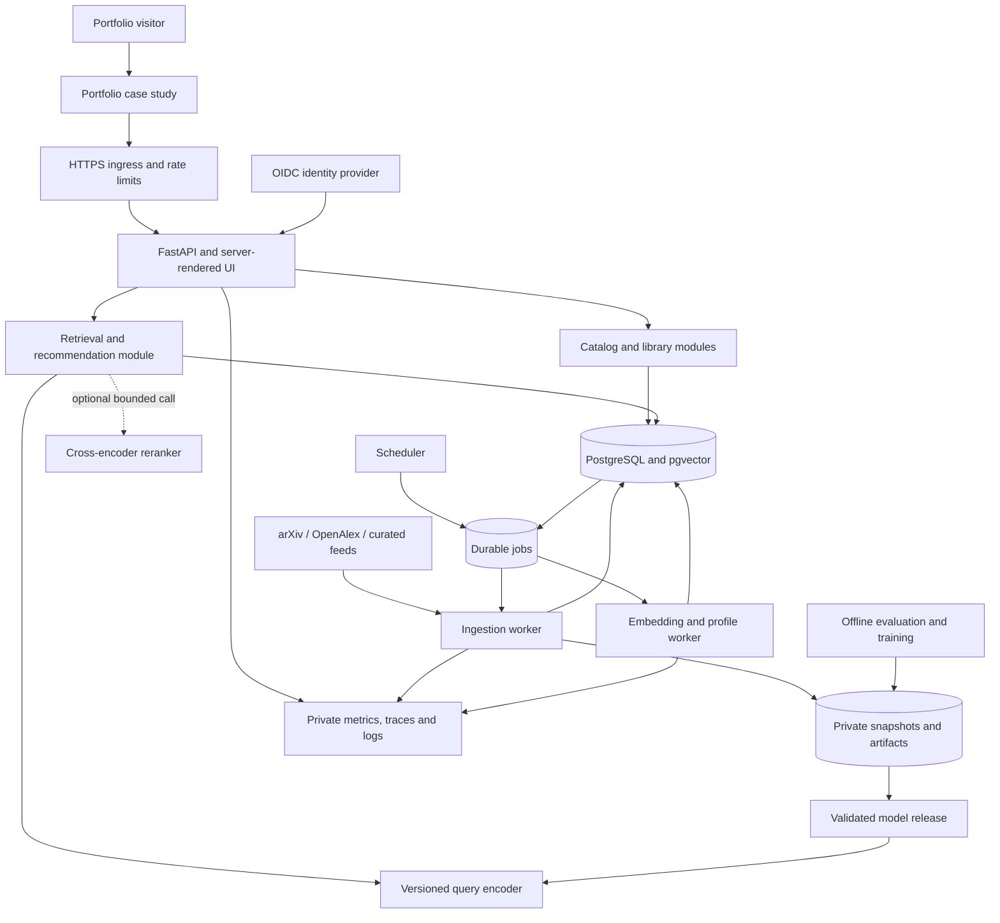

# Athena: production recommender and portfolio roadmap

**Prepared:** October 2, 2026 · **Repository reviewed:** `3f332a8` · **Status:** proposed implementation plan

## 1. Recommendation

Build Athena into a research discovery product that can demonstrate this complete loop:

> A visitor describes a technical interest, discovers relevant papers, saves a few, receives better recommendations, understands why they appeared, and can inspect evidence that the system is accurate and dependable.

The strongest portfolio result is a working, evaluated, recoverable system with clear design decisions. Prioritize hybrid retrieval, content-based personalization, data quality, reproducible evaluation, and reliable delivery. Add a learned ranker and one cloud deployment experiment after those foundations work.

The confirmed career emphasis is **AI / ML engineering with strong backend and DevOps skills**. This roadmap assumes a solo developer and also builds architecture and product-design evidence. It preserves the current FastAPI/PostgreSQL application and Mac mini deployment investment. Time estimates are planning ranges, not delivery commitments; budget and target employers have not been specified.

**Two completion levels:**

- **Portfolio launch:** a public, accessible discovery demo with evaluated recommendations, meaningful explanations, operational safeguards, and a technical case study. Anonymous discovery must work without registration.
- **Production release for real users:** additionally supports secure private libraries, controlled personalization, scheduled data updates, deletion, monitored service targets, and demonstrated recovery. “Production grade” is a set of verified properties at a stated operating scale, not a technology count.

A Mac mini can support a credible limited-scale release. It cannot establish high availability without addressing its host, power, network, and Docker Desktop dependencies. Document those limits rather than attaching an enterprise availability claim to a single machine.

## 2. What exists today

This assessment covers source, schema, tests, templates, CI/CD, and operational documentation. It is not a penetration test or live infrastructure audit.

| Area | Verified in the repository | Implication |
| --- | --- | --- |
| Application | FastAPI, Jinja templates, JSON API, SQLAlchemy, Alembic | A useful modular-monolith foundation; no rewrite is needed. |
| Catalog | arXiv/OpenAlex imports, normalized identifiers, source payloads, import runs | There is real data engineering to build on. |
| Correctness | Per-record transactions, serialized identity resolution, replay safety, conflict rejection, older-version protection | Preserve these guarantees when adding workers and derived data. |
| Search | GIN full-text index, filters, bounded cursor pagination | Matching is lexical; results sort by publication date and ID, not relevance. |
| UI | Responsive catalog/detail templates, source links, provenance, empty states, skip link | A coherent starting design; interactive UX and accessibility still need validation. |
| Observability | Request IDs, structured request logs, route-level counts/latency, liveness/readiness | No recommendation quality, job freshness, or external availability monitoring yet. |
| Delivery | CI with PostgreSQL tests; ARM64 build and smoke test; digest deployment; backup before migration | Strong release scaffolding; committed workflows do not prove that a real server is configured or healthy. |
| Recommendation product | No embeddings, recommendation endpoint, personal library, event history, or evaluation set | Athena is currently a searchable catalog, not yet a recommender. |

**Checks run for this review:** `pytest -m 'not integration' -q`: **35 passed, 15 deselected**; `ruff check .`: passed; `ruff format --check .`: 27 files formatted. Database integration tests, real deployments, visual/browser checks, and concurrent load tests were not run during this review. Deployment unit tests use a fake Docker command and establish script control flow, not actual server recovery.

### Project-specific gaps to resolve

| Priority | Finding and evidence | Required action |
| --- | --- | --- |
| Before evaluating models | [catalog.py](../src/athena/catalog.py) filters with full-text search but orders by date; the schema already weights title/abstract tokens. | Add a relevance-ranked lexical baseline and retain a separate “Newest” sort. Do not describe the current implementation as BM25. |
| Before evaluating models | [operations.md](operations.md) reports 55 historical cross-source duplicate pairs, approximately 300 same-title OpenAlex copies, and 12 older out-of-policy records. These counts were documented previously, not remeasured here. | Produce a fresh audit; reconcile verified identity conflicts, model publication families, and quarantine invalid records without guessing from titles. |
| Before evaluating models | The same documented trial reports 7,692 of 7,875 papers in 2026. | Add representative historical coverage; evaluate seminal-paper and recent-paper discovery separately. More newest-first imports alone will not fix the skew. |
| Before public exposure | [deploy/compose.yaml](../deploy/compose.yaml) supplies the same initialized PostgreSQL role to web, migration, and ingestion. | Introduce separate least-privilege roles. Web must not retain database owner/bootstrap privileges. Test grants explicitly. |
| Before public exposure | [main.py](../src/athena/main.py) exposes `/metrics` without authentication; public ingress/rate limits are absent from release configuration. | Block metrics and administration at public ingress; add HTTPS, resource limits, proxy trust rules, and abuse controls. Existing CSP and escaping are useful foundations. |
| Before reliable freshness | [providers.py](../src/athena/ingestion/providers.py) requests only non-retracted OpenAlex works, and [models.py](../src/athena/models.py) has no first-class retraction/tombstone state. | Recheck known IDs through an update path that can observe retractions and removals. Filtering new imports cannot retract a previously indexed work. |
| Before model lineage | Source records keep the latest payload; [service.py](../src/athena/ingestion/service.py) advances `updated_at` even on many unchanged replays. | Add source/content revisions and a normalized content hash. Trigger embeddings on actual eligible text changes, not every upsert. |
| Before multi-source ranking | OpenAlex abstracts are deliberately omitted; topics mix arXiv codes and OpenAlex display names. | Preserve the reuse restriction, track text coverage, introduce topic mappings, and evaluate title-only records separately. |
| Before availability claims | [deployment.md](deployment.md) describes local backups, manual recovery, and unverified server/reboot readiness. | Verify deployment, off-machine restore, reboot recovery, and rollback on the actual serving environment. |

## 3. Product scope and user experience

Start with English-language AI, ML, and adjacent engineering research. Treat journal articles, conference papers, reviews, and preprints as distinct content types. A journal is a venue users can browse or follow; recommend its articles initially. A separate “journals to follow” recommender is optional.

If “technical articles” includes engineering blogs and tutorials, add curated feeds later as a separate source class. Keep their provenance, type labels, quality rules, and evaluation slices distinct from scholarly publications. Do not start with an unrestricted web crawler.

### Core user journeys

| Journey | Features to implement | Acceptance evidence |
| --- | --- | --- |
| First visit | Browse without login; choose interests or a clearly labeled sample persona; offer useful sample searches. | A new visitor reaches relevant results in a short moderated walkthrough without setup instructions. |
| Search | Natural-language queries, exact terms/DOI lookup, relevance/newest sorting, author/topic/venue/type/date filters, clear zero-results guidance. | Benchmark includes exact technical terms, conceptual queries, missing abstracts, and restrictive filters. |
| Understand a recommendation | “Similar to this saved paper,” matched interests, source/date/type, available abstract, original source. | Reasons derive from actual retrieval/profile signals; similarity is not presented as a probability or quality score. |
| Build a library | Save/unsave, named private collections, reading status, notes, BibTeX/RIS export. | Ownership enforced on every read/write/export; session survives normal navigation; export is valid and escaped. |
| Shape the feed | Follow topics/authors/venues; like, dismiss, “already read,” mute a topic, adjust recency/diversity, reset profile. | Hide/mute actions affect the next response; undo/reset works; profile changes are visible and understandable. |
| Explore a field | Similar papers, related methods, foundational versus recent work, publication-version relationships. | Duplicate family members do not fill the same recommendation page. |
| Return later | Saved searches and optional digests with explicit subscription and unsubscribe controls. | Scheduled delivery is idempotent and opt-in. This can wait until after the main release. |

### Design work worth showcasing

- Write a one-page product brief, target-user hypotheses, journey map, and information architecture: Discover, For You, Library, Paper, Settings.
- Define a compact design system: typography, spacing, color/contrast, components, focus states, loading, empty, error, and stale-data states. Extend the current visual identity.
- Preserve filters and scroll position when returning from a paper. Make saves/dismissals responsive with recoverable error states. Separate future mutation forms from the current catalog search form.
- Show missing abstracts and stale feeds honestly. Explain whether a summary uses an abstract or full text. Avoid calling venue membership evidence of peer review.
- Validate keyboard navigation, focus, screen-reader names, mobile layouts, zoom, and contrast. Use WCAG 2.2 AA as a design/test target; record manual findings alongside automated checks. [WCAG 2.2](https://www.w3.org/TR/WCAG22/)
- Conduct 3–5 usability sessions, record task completion and misunderstandings, and publish one before/after design example. A frontend framework migration is justified only by interaction needs.

## 4. Target architecture

Keep one codebase with explicit modules and separately runnable web and worker processes. Start with PostgreSQL for canonical data, vector storage, and a durable job table. Introduce another service when a measured requirement warrants it.

`Jobs` is initially a PostgreSQL table, not a separate database. Arrows describe the proposed architecture, not existing implementation. Provider fetching, document embedding, and training run outside web request handlers. Query encoding and optional reranking are bounded parts of serving; they may run locally in the application initially, subject to CPU/memory benchmarks.

### Boundaries and contracts

| Module | Owns | Contract |
| --- | --- | --- |
| Ingestion | Provider adapters, checkpoints, source versions, reconciliation | Emits a content revision only after durable canonical commit; replay is safe. |
| Catalog | Papers, identifiers, families, venues, topics, eligibility | One canonical identity and shared eligibility policy across retrieval paths. |
| Library/identity | Accounts, collections, feedback, privacy preferences | User ownership is checked server-side; private data never enters a shared cache. |
| Retrieval | Lexical/dense candidates, filters, result snapshots | Returns IDs, retrieval ranks, scores, and model/index revision. |
| Recommendation | Profiles, candidate mixing, reranking, diversity, reasons | Produces a versioned, inspectable recommendation list with fallback metadata. |
| Evaluation | Judgments, frozen corpora, experiments, promotion reports | Reproduces results from pinned inputs and configurations. |
| Operations | Builds, deployments, telemetry, recovery | Promotes compatible application/schema/model artifacts together. |

Suggested additions are `retrieval/`, `recommendations/`, `library/`, `jobs/`, and `evaluation/`. Extract route modules as responsibilities grow; avoid a generic abstraction framework before the second implementation exists.

### Data and API additions

Preserve existing paper IDs and URLs. Add migrations incrementally:

- **Source revisions:** source ID, upstream update time, fetched time, normalized content hash, payload/artifact reference, schema version, import ID, field provenance and reuse policy. Archive only allowed fields; immutable does not mean exempt from retention/deletion requirements.
- **Catalog quality:** normalized venue/author/topic identities where supported, publication-family edges with evidence/confidence, retraction/withdrawal state, language, content type, text availability, eligibility and suppression reason.
- **Embeddings:** unique `(paper_id, content_revision, model_revision)`; text recipe, dimension, normalization, checksum, status/error, generated time. A model release points at a compatible embedding set/index.
- **Personal data:** identity subject, preferences, collection ownership, collection items, reading status, explicit feedback, retention/deletion state. Index access paths by owner.
- **Events and impressions:** immutable event ID, schema version, user or ephemeral session, recommendation request ID, paper ID, position, model/ranker version, event time, ingestion time, and event kind. Store only the context needed for evaluation, with a documented retention period.
- **Jobs/releases:** deduplication key, lease owner/expiry, attempts, next retry, error category, completion time; evaluation-run manifest; active and previous model release.

Proposed endpoints: `/api/search`, `/api/papers/{id}/similar`, `/api/recommendations`, `/api/collections`, `/api/feedback`, and `/api/events`. Keep current catalog endpoints compatible. Specify bounded inputs, error schemas, pagination, authorization, idempotency on writes, and rate-limit responses in OpenAPI. Use a saved result-list ID plus offset for stable personalized pagination; a date cursor cannot paginate a changing relevance ranking reliably.

## 5. Prioritized implementation backlog

**P0:** required for a safe, credible public recommendation demo. **P1:** completes the product for real users and strengthens engineering evidence. **P2:** bounded experiments after the core release. Sizes are focused work estimates including relevant tests/docs: **S** 1–2 days, **M** 3–5 days, **L** 1–2 weeks. They exclude unfamiliar-tool learning and are not additive sprint commitments.

### Data engineering and scholarly integrity

| ID | Priority / size | Feature and completion condition |
| --- | --- | --- |
| D1 | P0 / M | **Catalog audit and cleanup workflow.** Export counts by source/year/topic/type/text coverage, conflict candidates and invalid records. Provide dry-run reconciliation, backup, audit trail, redirect/alias mapping, and transaction-safe reassignment of dependent IDs. Never auto-merge solely on title. |
| D2 | P0 / M | **Representative evaluation corpus.** Deliberately sample historical and recent papers across technical topics. Publish sampling rules and missingness; freeze a permitted snapshot or reproducible ID manifest. |
| D3 | P0 / M | **Content identity and reuse policy.** Hash normalized eligible text; version preprocessing and source fields. Track what can be displayed, embedded, summarized, archived, and exported. An unchanged replay produces no new embedding job. |
| D4 | P1 / L | **Scheduled incremental ingestion.** Use provider-supported update windows/cursors where available, overlap windows and replay deduplication, bounded backfills, global provider pacing, budget limits, and resumable job state. Test delayed records and checkpoint failure. Do not claim exhaustive capture without provider support. |
| D5 | P1 / M | **Retraction/removal propagation.** Refresh known IDs through a separate reconciliation path; record status and reason, hide in recommendations, retain an explanatory detail page when appropriate, invalidate derivatives. Treat transient 404s cautiously. |
| D6 | P1 / L | **Publication families and normalized entities.** Link preprint/published/version records with evidence, preserve original identifiers, and deduplicate presentation. Distinguish author identity from identical author names. |
| D7 | P2 / M | **Curated technical feeds.** Add an adapter contract, allowlisted publishers, canonical URLs, attribution, feed health, and content-type labels. Test malformed feeds and URL handling; do not offer arbitrary URL fetching initially. |

OpenAlex full-text access does not transfer copyright in PDFs, and arXiv papers can have different licenses. Preserve the existing conservative handling of OpenAlex abstracts until a documented field-level decision exists. [OpenAlex full text](https://help.openalex.org/access/fulltext/), [arXiv licenses](https://info.arxiv.org/help/license/index.html)

### Retrieval and recommendations

| ID | Priority / size | Feature and completion condition |
| --- | --- | --- |
| R1 | P0 / M | **Ranked lexical baseline.** Rank query matches using PostgreSQL text relevance; boost exact title/identifier matches, keep newest sorting separately, validate filters and stable pagination. Compare against the current date-ordered results. |
| R2 | P0 / L | **Versioned embeddings and similar papers.** Compare a compact general retrieval encoder and a scholarly encoder on the same local benchmark. Support title-only inputs explicitly; record truncation, license, revision and CPU cost. Exclude the seed paper and its known family. |
| R3 | P0 / M | **Hybrid search.** Retrieve bounded lexical and dense candidate lists, combine using reciprocal rank fusion, deduplicate and enforce filters. Missing embeddings fall back to lexical retrieval. Tune retrieval depth/fusion settings on validation data. |
| R4 | P0 / M | **Cold-start recommendations.** Use selected topics and positive seed papers to build an ephemeral profile; offer labeled sample personas. Blend a topical fresh-paper baseline with profile candidates. This delivers recommendations before account infrastructure. |
| R5 | P0 / M | **Diversity and faithful explanations.** Cap repeated families/venues where appropriate, allow fresh/foundational and focused/exploratory modes, and generate reasons from actual contributing signals. Evaluate relevance-versus-diversity tradeoffs. |
| R6 | P1 / L | **Persistent content-based personalization.** Build time-aware profiles from saves/likes and selected interests, distinguish dismiss reasons, exclude seen/read/muted items as configured, and support reset. Share feature transformations between offline evaluation and serving. |
| R7 | P1 / M | **Cross-encoder experiment.** Rerank only a bounded top candidate set. Publish quality, p95 latency, memory and cost with/without it; enforce timeout and hybrid fallback. Ship only if its measured benefit is worth the serving cost. |
| R8 | P2 / L | **Learned ranking/collaborative filtering.** Compare a feature-based ranker and simple item-interaction baseline only once real consented history supports evaluation. Use chronological splits and point-in-time features. If data is insufficient, demonstrate the method on a licensed external dataset and label that result separately. |
| R9 | P2 / M | **Citation-aware discovery.** Add reference/citation relationships and graph candidates. Avoid making raw citation counts a proxy for truth; control age/topic bias and evaluate incremental benefit. |

PostgreSQL provides `ts_rank`/`ts_rank_cd`; these are suitable first ranking baselines and are not BM25. [PostgreSQL text-search controls](https://www.postgresql.org/docs/current/textsearch-controls.html)

Use pgvector exact search first. Benchmark approximate HNSW only when latency or corpus growth justifies it; filtered approximate search needs separate recall checks and a strategy for underfilled results. Add a compatible PostgreSQL extension image and tested migrations rather than assuming the current `postgres:17-alpine` image has pgvector installed. [pgvector documentation](https://github.com/pgvector/pgvector/blob/master/README.md?plain=1)

Separating inexpensive candidate retrieval from a more expensive cross-encoder is an established architecture. Model suitability still needs Athena-specific measurement. [Sentence Transformers retrieve and rerank](https://sbert.net/examples/sentence_transformer/applications/retrieve_rerank/README.html)

### Product, privacy, and application security

| ID | Priority / size | Feature and completion condition |
| --- | --- | --- |
| P1 | P0 / M | **Public demo journey.** Anonymous interests, sample personas, explanations, mobile/keyboard support, and a resettable session. Demo activity is labeled and excluded from real-user model evaluation. |
| P2 | P1 / L | **Accounts and session security.** Use a maintained OIDC integration; implement secure HttpOnly cookies, session expiry/revocation, CSRF protection for mutations, login throttling, and private admin authorization. No custom password system. |
| P3 | P1 / L | **Libraries and controls.** Collections, reading state, feedback, notes, follows, export, profile reset; test two-user isolation on every endpoint and cached result. Complete these before inviting persistent users. |
| P4 | P1 / M | **Event instrumentation and privacy.** Log served lists separately from genuinely visible impressions; validate event IDs/ownership, bound payloads, rate-limit, deduplicate and filter bots. Explain collection; implement consent/preferences where applicable, account export/deletion, and retention. |
| P5 | P1 / M | **Private operator workflow.** Inspect failed jobs/conflicts, retry with audit logging, suppress records, switch validated models, and review freshness. A secured CLI is sufficient initially. |
| P6 | P2 / M | **Saved searches/digests.** Opt-in scheduling, delivery deduplication, unsubscribes, bounce handling, and predictable timezone semantics. |

Treat reading history and research interests as private data. Deletion must remove profile/event associations and invalidate derived caches; define backup retention and reapply deletion records after a restore. Authentication does not replace object-level authorization. Review session and login implementation against maintained security guidance. [OWASP authentication guidance](https://cheatsheetseries.owasp.org/cheatsheets/Authentication_Cheat_Sheet.html)

### MLOps, DevOps, and reliability

| ID | Priority / size | Feature and completion condition |
| --- | --- | --- |
| O1 | P0 / M | **Public serving boundary.** Dedicated HTTPS subdomain linked from the portfolio; trusted hosts/proxies; private database/metrics/admin; endpoint limits, request size/time limits, least-privilege DB roles, and container CPU/memory/log rotation limits. Verify from outside the private network. |
| O2 | P0 / M | **Recovery that has been exercised.** Scheduled encrypted off-machine backups with retention; restore into a disposable environment, verify counts/identities and user data, test app rollback and reboot recovery, record achieved RPO/RTO. Protect backup credentials. |
| O3 | P0 / M | **Serving resilience and observability.** External uptime check, alerts on errors/latency/disk/backups, graceful model fallback, bounded inference concurrency, and useful error pages. Keep monitoring private; publish only sanitized evidence. |
| O4 | P0 / M | **Reproducible model release.** Version code, corpus, text recipe, encoder/ranker, vector dimensions/index, and eval manifest. Build a new compatible embedding set, validate it, atomically switch the active release, and retain the previous set for rollback. |
| O5 | P1 / M | **Durable workers.** Database-backed jobs with unique content/model keys, leases, heartbeat, bounded retries with jitter, dead-letter review, and graceful shutdown. Commit content revision and enqueue intent together; workers tolerate duplicate delivery. |
| O6 | P1 / M | **Delivery hardening.** Pin action revisions and image digests with an update process; dependency/secret/container scans; SBOM and build provenance; restricted release credentials; ephemeral integration/staging smoke tests. Keep migrations backward compatible. |
| O7 | P1 / L | **Performance and failure harness.** Reproducible mixed-traffic load tests, query plans, pool saturation and ingestion contention measurements; kill a worker, interrupt model rollout, break the encoder, and test recovery. Do not send benchmark load to source providers. |
| O8 | P1 / M | **Quality/freshness monitoring.** Track eligible embedding coverage, job lag, source success times, profile age, zero results, fallback rate, distribution shifts and sampled judgment regressions. Drift is an investigation trigger, not proof of quality loss. |
| O9 | P1 / L | **One cloud/IaC demonstration.** Provision and tear down an isolated Linux deployment with Terraform, private database networking, least-privilege identity, HTTPS and backup configuration. Run the same smoke/restore checks; publish a cost breakdown. Make permanent cloud hosting conditional on budget. |
| O10 | P2 / M | **Measured scaling experiment.** Compare exact/HNSW retrieval, bounded caching, or separate inference on stated hardware/corpus. Add Redis, a queue broker or another database only when the experiment explains why. |

Use traces to connect a request to retrieval, inference and SQL, alongside the existing logs/metrics; avoid raw query text, interests, or user IDs in public telemetry and metric labels. [OpenTelemetry signals](https://opentelemetry.io/docs/concepts/signals/)

Third-party Actions should be pinned to reviewed immutable revisions, with least-privilege credentials and an update mechanism. Preserve the existing separation between pull-request checks and deployment access. [GitHub Actions secure use](https://docs.github.com/en/actions/reference/security/secure-use)

### Optional generative AI extension

**G1 — P2 / L: cited research brief.** Let a user compare a few selected papers using permitted text, with claim-level references and explicit abstention when evidence is missing. Show whether inputs contain abstracts or full text. Version prompts/models and cache by source revision; evaluate citation correctness, support for claims, unsupported assertions, latency, and cost on a human-reviewed set. Add request quotas and a daily spend cutoff.

Treat imported text as untrusted evidence, never executable instructions. The generator should have no privileged tools and should not fetch arbitrary URLs. Full-text retrieval would require independent download limits, license checks, sandboxed parsing, SSRF controls, and chunk provenance. Ship this after recommendation quality; an LLM summary does not establish that recommendations are good.

## 6. Evaluation plan: the main AI engineering artifact

Implement evaluation before tuning embeddings or personalization. Keep three questions separate: **Can search retrieve useful papers? Can a profile recommend useful unseen papers? Can the system serve both reliably?**

### Offline datasets

1. Start with 30 judged queries to make the harness useful quickly; grow to approximately 100–150. Include exact methods/identifiers, conceptual needs, related-paper requests, applications, recent-work and foundational-work intents, rare topics, and constrained filters.
2. Pool candidate papers from lexical, dense, and hybrid systems. Blind the system labels when judging; label relevance 0–3 with a written rubric. Unjudged does not mean irrelevant. Track judgment coverage and pooling bias.
3. Add 15–20 curated interest profiles with seed papers and explicit goals. Label these as synthetic evaluation personas, not real users. Ensure known seed papers and duplicate family members cannot count as successful unseen recommendations.
4. Freeze corpus IDs/revisions, labels, sampling rules and splits. Separate tuning and held-out testing; keep related paper families together. For behavioral experiments, use chronological history and make features available only from before the prediction time, including citation counts and publication eligibility.
5. Have a second reviewer judge a subset when possible, publish disagreement examples, and report author-only labeling as a limitation. Do not use the same LLM as both generator and sole quality judge.

### Baselines, metrics, and decisions

| Question | Compare | Report |
| --- | --- | --- |
| Search quality | Current newest-first matches → ranked lexical → dense → hybrid → optional reranker | nDCG@10, judged Recall@50, MRR for known-item queries, plus latency and text/source/topic slices. |
| Recommendation quality | Topic-matched recent items → seed/profile similarity → diversified hybrid profile feed | Profile nDCG@10, catalog coverage, intra-list diversity, duplicate rate, freshness mix, and explicit reviewer preference. |
| Approximate retrieval | Exact vector results → HNSW under identical filters | ANN Recall@K against exact neighbors, p95 latency, index memory/build time. ANN recall is different from relevance recall. |
| Personalized learning | Existing content-based feed → interaction-based challenger | Chronological held-out ranking metrics, cold/new-user slices, data volume/sparsity, and exposure limitations. |
| Product usefulness | Observed eligible impressions → saves, useful-feedback, reading actions | Per-user/per-session rates, counts and uncertainty; clicks alone are a weak signal. |

Ranking and beyond-accuracy metrics answer different questions; relevance, diversity, novelty and coverage should be reported together. Popularity-derived novelty requires meaningful interaction data. [Recommenders evaluation documentation](https://recommenders-team.github.io/recommenders/evaluation.html)

**Proposed promotion rule:** preserve a locked test set, compare paired per-query/profile results, report uncertainty and per-slice regressions, and promote only within latency/cost budgets. A 5–10% relative nDCG improvement is a useful experimental aim, not a promised result or universal cutoff. Predeclare the practical improvement and tolerated regression before examining test results. If a more complicated model does not help, keep the simpler one and publish the finding.

Each experiment should produce a small report with corpus and label counts, model/config revisions, hardware, random seeds, quality metrics, bootstrap intervals where useful, warm/cold latency, memory, cost, and at least five failures. Include ablations for fusion, profile signals and diversity. Do not repeatedly tune against the held-out test set.

**Online experiments come later.** With portfolio traffic, an A/B result will often be underpowered. Begin with qualitative feedback and offline evaluation. When traffic supports a predeclared sample-size/power analysis, assign consistently by user, record exposure, define one primary outcome and safety/latency guardrails, and avoid repeated significance checking. Log exploration propensities only if implementing a policy whose probabilities are known; ordinary click logs do not support unbiased counterfactual evaluation.

## 7. Serving targets and operational proof

These are **initial test targets**, not current capabilities. Calibrate after measuring the actual host, encoder and catalog. SLOs should reflect user-visible behavior and drive concrete operational decisions. [Google SRE: implementing SLOs](https://sre.google/workbook/implementing-slos/)

| Property | Initial target | How to establish evidence |
| --- | --- | --- |
| Discovery availability | 99.5% successful public discovery probes over a rolling 30 days | External probe exercises a useful endpoint; report exclusions and outages. Accumulate the window before claiming achievement. |
| Search latency | p95 ≤ 500 ms warm at 10 requests/sec | Start with a 10k-paper corpus, 5-minute warmup and 15-minute mixed browse/search/detail run; record host specs, concurrency, p99, errors and cache hit rate. Repeat at 100k if affordable. |
| Personalized feed latency | p95 ≤ 1 second under the declared load | Measure cold and warm profiles, sparse inputs, reranker on/off, and degraded mode separately. |
| Freshness | Scheduled successful source sync within 24 hours; 95% of eligible changed papers embedded within 1 hour of ingestion | Measure timestamps and queue age. Display upstream outages; source sync age is not proof of complete upstream coverage. |
| Recovery | RPO ≤ 24 hours and RTO ≤ 2 hours for the initial deployment | Time an off-machine restore into a clean environment and verify data plus a working app. Tighten if user activity demands it. |
| Rollback | Prior compatible application/model restored within 15 minutes | Test image/model rollback; never assume database downgrade is safe. |
| Privacy and consistency | No cross-user access; no suppressed work returned after invalidation completes | Integration tests plus an end-to-end deletion/suppression drill, including caches and future restored backups. |

Document a component-level latency budget. Load query models once per process, account for process duplication of model RAM and DB pools, and set inference concurrency limits. An async endpoint does not make CPU-bound inference nonblocking. Prefer cached/precomputed recommendations with explicit freshness over unbounded synchronous work.

Required degradation behavior:

- Encoder unavailable: serve ranked lexical search and topic-based recommendations with honest fallback labeling.
- Reranker unavailable: return fused candidates within the response deadline.
- Worker unavailable: serve current compatible embeddings, expose lag, and alert; do not make readiness depend on external providers.
- Provider unavailable: browse existing catalog, retry asynchronously within budget.
- Database unavailable: bounded 503 and a useful unavailable page; liveness remains independent. Do not fabricate success.
- Bad model release: retain and activate the previous compatible model/index; do not mix vector spaces.

## 8. Hosting and cost strategy

Put the application at a dedicated subdomain such as `athena.<your-domain>` and link to it from a portfolio case-study page. Keep the main portfolio independent so it remains available during Athena maintenance. A separate subdomain fits the current `frame-ancestors 'none'` policy better than an iframe and simplifies cookies/navigation.

### Initial deployment

Retain the Mac mini release path. Add an HTTPS reverse proxy or managed tunnel, expose only the intended web routes, keep administration on the private network, and confirm reboot/sleep behavior. Backups must leave the machine. Document the chosen DNS/TLS provider, credential rotation, and what happens during a home-network outage. Include a short recorded demo and a static case-study fallback.

### Cloud learning milestone

Use one reproducible deployment on a Linux host or managed container platform, with managed PostgreSQL when its cost is acceptable, private artifact storage and short-lived deployment credentials. For AWS-focused interviews, a time-boxed Terraform deployment using ECS/Fargate, RDS PostgreSQL with compatible pgvector support, S3 and IAM is a possible exercise; validate regional support and current costs before selecting it. A small VM with Compose is a simpler alternative. Choose one path rather than maintaining both indefinitely.

Include infrastructure state protection, environment isolation, secret injection, database encryption, rollback, teardown and orphan-resource detection. Current release images are ARM64-only: select compatible compute or add tested multi-architecture builds. Keep public networking off the database regardless of hosting provider.

**Provisional budget constraint:** design toward a $30/month incremental operating cap for the initial self-hosted demo, excluding existing hardware/internet. This is a suggested limit, not a provider price estimate. Obtain current quotes for the selected stack; managed database/container combinations may exceed it. Track storage, backup, egress, hosted inference, monitoring and idle resources. Use alerts at 50/80/100% of the chosen budget, hard quotas for optional AI requests, and automated teardown for learning environments. Report cost per 1,000 recommendation requests and per 1,000 newly embedded papers from observed usage.

## 9. Implementation sequence and release gates

Work in end-to-end slices. Each milestone ends with a demo, tests, an architecture decision where needed, and a short learning report. Effort ranges assume familiarity with the stack; part-time study will extend calendar time.

| Milestone | Rough focused effort | Main dependencies and deliverables | Exit gate |
| --- | --- | --- | --- |
| M0 — Establish truth | 1 week | D1/D2 audit, product brief, 30-query judgments, R1 lexical baseline | A reproducible baseline report; documented catalog gaps and prioritized cleanup. |
| M1 — Ship discovery | 2–3 weeks | D3, R2–R5, P1, O4; exact vectors, hybrid, similar papers, anonymous interest profiles | A visitor can discover personalized results; held-out comparison and model rollback work. |
| M2 — Launch portfolio demo | 1–2 weeks | O1–O3, critical UI/accessibility fixes, case-study page and recorded walkthrough | HTTPS demo, restricted internal endpoints, measured latency, successful restore and graceful fallback. Publish here. |
| M3 — Support real readers | 2–4 weeks | P2–P5, R6, D4–D6, O5/O8; accounts, libraries, private telemetry and dependable updates | Isolation/deletion tests pass; feedback updates profiles; interrupted jobs recover; retractions propagate. |
| M4 — Demonstrate production engineering | 2–3 weeks | O6–O9, R7 experiment; observability, load/failure reports, cloud/IaC exercise | Reproducible deployment and teardown, measured operating targets, quality/latency/cost decision for reranking. |
| M5 — Choose one specialization | 1–3 weeks initially | R8, R9, D7, G1 or O10 depending on target role | One clear hypothesis, baseline, measured result and honest limitations. |

The existing [architecture sequence](architecture.md) places accounts before discovery. This proposal moves anonymous semantic discovery and evaluation earlier so the portfolio demonstrates AI value sooner. It is a proposed sequencing change, not a claim that the existing release plan or implementation has already changed.

### First ten implementation tasks

1. Generate a fresh read-only catalog quality report and record real counts.
2. Define the target reader, three main tasks, and explicit content scope.
3. Label 30 search queries; reserve a held-out subset before tuning.
4. Add ranked lexical search plus tests for relevance/newest pagination.
5. Implement a reviewed duplicate/conflict reconciliation workflow.
6. Add content hashes, field policies and model-release metadata migrations.
7. Benchmark two embedding candidates using eligible text, including title-only records.
8. Implement exact-vector similar papers and hybrid retrieval with lexical fallback.
9. Add interest-based anonymous recommendations, explanations and session reset.
10. Complete the public serving/backup/monitoring gate and publish the first case study.

### Definition of portfolio launch

- [ ] Live demo is reachable from the portfolio without requiring an account.
- [ ] Search, similar papers and interest-based recommendations work on real attributed records.
- [ ] Quality report compares at least lexical, dense and hybrid systems on held-out judgments.
- [ ] Model/data revisions are traceable; fallback and rollback have been exercised.
- [ ] HTTPS, private metrics/database, least privilege and abuse controls are verified.
- [ ] Backup restore succeeds; documented host limitations match the deployment.
- [ ] Main flows pass keyboard/mobile checks and a small usability review.
- [ ] Repository explains setup, architecture, experiments, costs and known limitations.
- [ ] Portfolio page contains a short demo, architecture diagram, actual measurements and one tradeoff story.

## 10. How to turn the work into interview evidence

### Learning progression

Pair implementation with small exercises you can explain without relying on a framework:

1. **Retrieval fundamentals:** calculate cosine similarity, reciprocal rank fusion and nDCG on a tiny hand-checked example; explain what each does and where it fails.
2. **Recommendation modeling:** implement a normalized weighted average of positive seed embeddings as the first profile baseline. Measure whether separate interest clusters improve mixed-interest profiles. Treat a dismissal as ambiguous feedback unless its reason is known.
3. **Experimental practice:** reproduce one result from a clean environment, inspect false positives/negatives, perform an ablation, and explain leakage and uncertainty.
4. **Training practice:** after the serving system works, run one bounded feature-based ranking or compact-encoder fine-tuning experiment on suitable licensed data. Include negative sampling, validation, checkpointing and comparison with an untrained baseline; keep it experimental if it cannot improve Athena honestly.
5. **Systems practice:** trace a request, measure a bottleneck, interrupt a worker, restore data, and explain the consistency and cost tradeoffs.

Write a short explanation and rehearse a five-minute walkthrough at each milestone. An experiment that fails to improve the baseline is still useful learning when the methodology and conclusion are sound.

### Portfolio evidence

| Skill | Artifact to publish | Question you should be able to answer |
| --- | --- | --- |
| AI/retrieval | Reproducible benchmark, error analysis, lexical/dense/hybrid ablation | When does semantic retrieval lose to lexical search, and why did you choose this encoder? |
| Recommendations | Cold-start design, profile update example, diversity experiment | How do you recommend without interaction history, and avoid a feedback loop? |
| Data engineering | Source contract, identity/family model, replay/conflict/retraction demonstration | What happens when records arrive twice, change, conflict or disappear? |
| Backend | API contracts, ownership tests, query plans, bounded failure behavior | How do you preserve consistency, prevent cross-user access and handle overload? |
| MLOps | Version manifest, promotion report, model/index rollback recording | How do you reproduce a recommendation and avoid incompatible embeddings? |
| DevOps/SRE | Release workflow, restore drill, load report, incident write-up | How do you know it is healthy, and recover when a release or host fails? |
| Cloud/security | Terraform environment, permissions diagram, cost/teardown report | Which resources are public, which credentials are privileged, and what costs money while idle? |
| Architecture | Context/container diagram, request/job sequence diagrams, ERD and ADRs | Why PostgreSQL and a monolith, and what evidence would justify splitting them? |
| Product/design | Brief, component system, usability findings and iteration | What was confusing for readers, and how did your design address it? |

Create concise ADRs for retrieval/storage choice, content reuse, recommendation objectives, identity/family reconciliation, durable jobs, auth/privacy, model release compatibility, and hosting. Each should name alternatives, consequences and a condition that would cause reconsideration.

Build a portfolio case study with: the user problem; a 60–90 second demonstration; the architecture; measured quality/latency/cost; the hardest failure and recovery; one rejected approach; and what you would change at 10× scale. Offer technical details on demand so recruiters can understand the product quickly.

Keep resume statements tied to evidence. For example: “Built a hybrid research recommender over **[measured corpus size]** papers, improving held-out nDCG@10 from **[baseline]** to **[result]**, with p95 latency **[measured]** on **[hardware/load]**.” Fill brackets only after measurement. Synthetic personas, local tests, and a cloud learning deployment must be labeled as such.

## 11. What to defer

Do not make Kubernetes, Kafka, a feature store, microservices, a dedicated vector database, multi-region failover, or agentic workflows prerequisites for the first release. Keep them available as scoped learning experiments with a measurable question.

Likewise, defer a full frontend rewrite, unrestricted full-text ingestion, automated paper-quality scores, social features, and fine-tuning a large model. They expand scope before establishing the central recommendation loop. A carefully measured simple model and a successful recovery drill offer strong interview material.

The project is ready to showcase once the public discovery loop and its evidence are convincing. Continue learning through targeted experiments while keeping the demo dependable.
